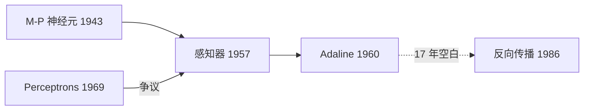

# Perceptrons

1969 年 Marvin Minsky 与 Seymour Papert 合著的一本书，用数学证明了**单层感知机的能力上限**：它只能划一条直线，凡是线性不可分的问题（最小的例子就是 XOR 异或）它都算不了。这本书直接终结了当时对感知器的热情，连接主义由此停摆到 1986 年。

## 它证明了什么
XOR 的四个点 (0,0)→0、(0,1)→1、(1,0)→1、(1,1)→0 在平面上呈对角分布，**没有任何一条直线能把两类分开**：

```
 1 |  ●(0,1)=1      ○(1,1)=0
   |
 0 |  ○(0,0)=0      ●(1,0)=1
   +---------------------------
      0              1
```

而单层感知机的判据就是 `w1·x1 + w2·x2 > θ`——一条直线。所以这不是"训练得不够久"或"学习率没调好"，是**结构性的算不了**。书里同时指出多层网络能解，但当时没有能训练多层网络的算法（反向传播要等到 1986 年才被推广开）。

## 容易搞混的
**这件事和「第一次 AI 寒冬」是两件常被合并的事，本图按严格口径分开。**

| | 1969《Perceptrons》 | 第一次 AI 寒冬（约 1974–1980） |
|---|---|---|
| 触发 | Minsky & Papert 证明单层感知机的局限 | 1973 年英国 Lighthill 报告、DARPA 撤资 |
| 打的是哪条线 | **连接主义** | 主要是**符号主义**（机器翻译、语音理解） |
| 持续到 | 1986 年反向传播推广开 | 约 1980 年专家系统商用回暖 |

通俗文章常把 1969 说成"第一次 AI 寒冬的开始"，口径上并不严谨：1969 冻住的是神经网络这条线，而教科书意义上的第一次 AI 寒冬砍的是符号主义那批项目。**本图取严格口径：1969 归连接主义。**

## 我的理解
待补：XOR 两层网络就能解，delta rule 1960 年（Adaline）就有，Minsky 自己也知道多层能解——那这 17 年真正卡住的是哪一样东西？还没想清楚。

## 线头
- **Marvin Minsky**：本书作者之一，符号主义阵营的代表人物；"谁在批评谁"这条线以后接这里
- **Seymour Papert**：另一位作者，后来的 Logo 语言与建构主义学习理论
- **线性可分 / 线性不可分**：这本书的数学核心，也是感知器的天花板
- **XOR / 异或**：最小的线性不可分例子，多层感知机那一节要接回来
- **多层感知机 / 反向传播（1986, Rumelhart-Hinton-Williams）**：越过这道坎的那一步，解冻点
- **Lighthill 报告（1973）/ DARPA 撤资**：第一次 AI 寒冬（符号主义那条）的触发点，和本节点**不是同一件事**
- **符号主义**：1969 之后接管话语权的那一派，1987 Lisp 机崩盘时轮到它挨冻

## 为什么这张图上没有「AI 寒冬」节点

2026-09-18 定的规矩：**寒冬不建成节点**。三条理由——

1. **填不出 `layer`**。寒冬不在栈的任何一层，不是理论、不是硬件、不是应用，它是资金和注意力的撤离。没有 layer 的点在历史视图上没有泳道可站，只能悬着。
2. **出不了有内容的题**。「第一次寒冬哪年开始」考的是背年份；「为什么单层感知机解不了 XOR」才考懂没懂。前者不配占一个能被复习的槽位。
3. **边全是弱关联**。Perceptrons → 寒冬只能连 `影响`，寒冬 → 反向传播连不出 `演化为`（寒冬不会「长出」BP）。所有边都是弱关联的节点，在图上等于孤岛。

**寒冬在这张图上的表达形式是时间轴上那段空白。** 连接主义这条线 1960 年（[[Adaline]]）之后一直到 1986 年（反向传播）没有任何节点，这个空档本身就是寒冬，比放一个灰色方块更说明问题：



同一条规矩对符号主义那条线的 1974–1980 空档、以及第二次寒冬（1987 Lisp 机）同样适用。

## 关系
- 争议:: [[感知器]]
